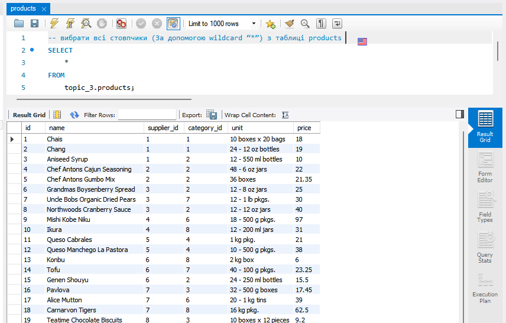
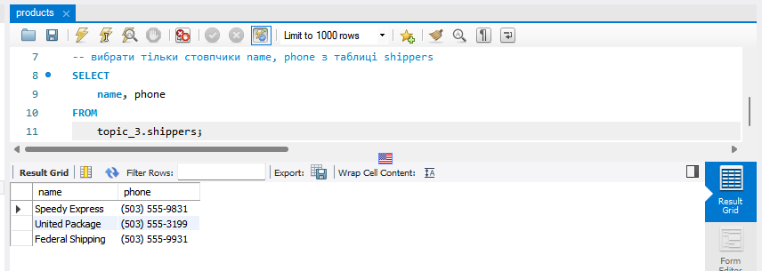
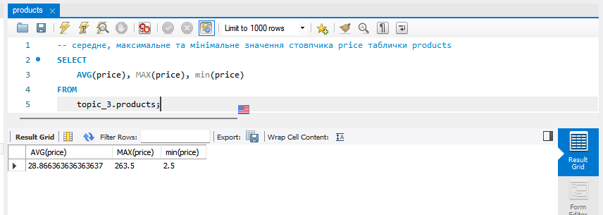
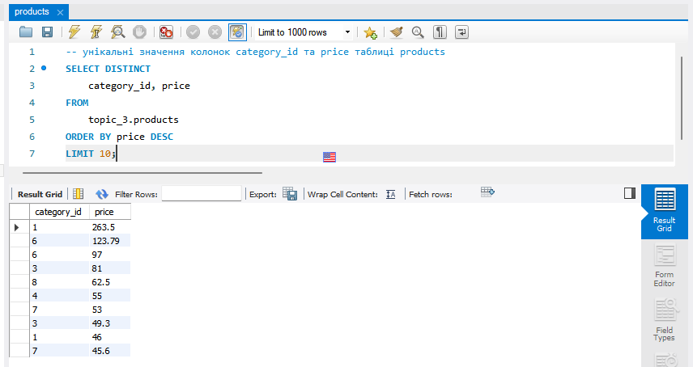
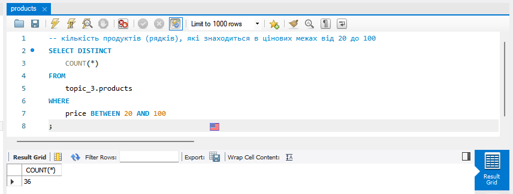
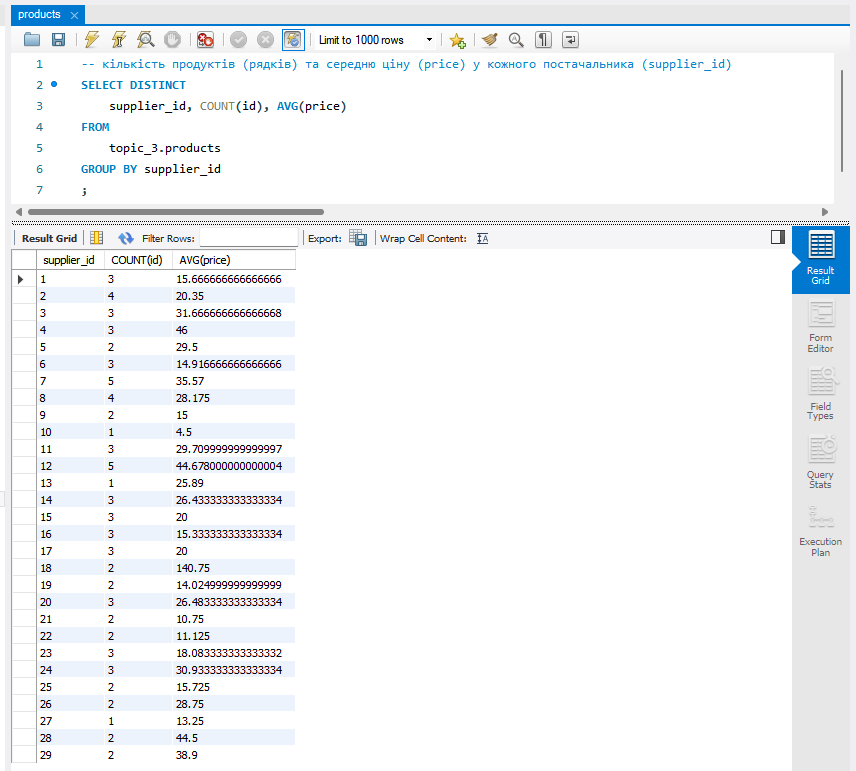

# goit-rdb-hw-03 Завантаження даних та основи SQL. DQL команди

## Завдання 1

Напишіть SQL команду, за допомогою якої можна:

- вибрати всі стовпчики (За допомогою wildcard “\*”) з таблиці products;
- вибрати тільки стовпчики name, phone з таблиці shippers,

```SQL
-- вибрати всі стовпчики (За допомогою wildcard “*”) з таблиці products
SELECT
    *
FROM
    topic_3.products;
```



```SQL
-- вибрати тільки стовпчики name, phone з таблиці shippers
SELECT
    name, phone
FROM
    topic_3.shippers;
```



## Завдання 2

Напишіть SQL команду, за допомогою якої можна знайти середнє, максимальне та мінімальне значення стовпчика _price_ таблички _products,_ та перевірте правильність її виконання в MySQL Workbench.

```SQL
-- середнє, максимальне та мінімальне значення стовпчика price таблички products
SELECT
    AVG(price), MAX(price), min(price)
FROM
    topic_3.products;
```



## Завдання 3

Напишіть SQL команду, за допомогою якої можна обрати унікальні значення колонок _category_id_ та _price_ таблиці _products._

Оберіть порядок виведення на екран за спаданням значення _price_ та виберіть тільки 10 рядків. Перевірте правильність виконання команди в MySQL Workbench.

```SQL
-- унікальні значення колонок category_id та price таблиці products
SELECT DISTINCT
    category_id, price
FROM
    topic_3.products
ORDER BY price DESC
LIMIT 10;
```



## Завдання 4

Напишіть SQL команду, за допомогою якої можна знайти кількість продуктів (рядків), які знаходиться в цінових межах від 20 до 100, та перевірте правильність її виконання в MySQL Workbench.

```SQL
-- кількість продуктів (рядків), які знаходиться в цінових межах від 20 до 100
SELECT DISTINCT
    COUNT(*)
FROM
    topic_3.products
WHERE
    price BETWEEN 20 AND 100
;
```



## Завдання 5

Напишіть SQL команду, за допомогою якої можна знайти кількість продуктів (рядків) та середню ціну (_price_) у кожного постачальника (_supplier_id_), та перевірте правильність її виконання в MySQL Workbench.

```SQL
-- кількість продуктів (рядків) та середню ціну (price) у кожного постачальника (supplier_id)
SELECT DISTINCT
    supplier_id, COUNT(id), AVG(price)
FROM
    topic_3.products
GROUP BY supplier_id
;
```


